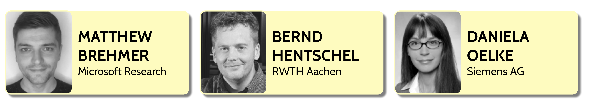

# The VisInPractice 2019 Organizing Team:

{::options parse_block_html="true" /}

<!-- 
 -->

**Email**: [vip@ieeevis.org](mailto:vip@ieeevis.org)

* **Daniela Oelke**, Siemens AG (VAST)
* **[Matthew Brehmer](https://mattbrehmer.github.io)**, Microsoft Research (InfoVis)
* **Matthew Larsen**, Lawrence Livermore National Laboratory (SciVis)

<!--  -->

<!-- 
 -->

<!-- 
 -->

<!-- ## Program Committee

t.b.a. -->

<!-- 
 -->

- - -